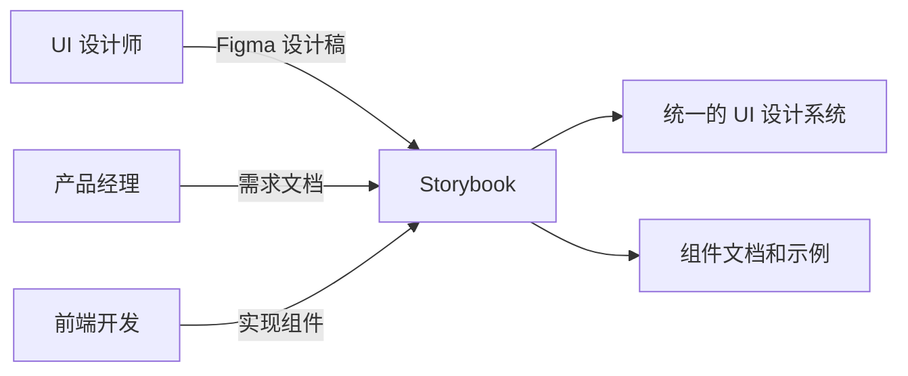

# Volt UI 设计系统

基于 PrimeVue Volt 和 Storybook 构建的 UI 设计系统，帮助产品经理、前端开发和 UI 设计师更好地协作。

## 📋 目录

- [快速开始](#快速开始)
- [项目结构](#项目结构)
- [组件库](#组件库)
- [设计令牌](#设计令牌)
- [使用指南](#使用指南)
- [团队协作](#团队协作)
- [开发规范](#开发规范)

## 🚀 快速开始

### 安装依赖

```bash
npm install
```

### 启动 Storybook

```bash
npm run storybook
```

Storybook 将在 `http://localhost:6006` 启动。

### 启动开发服务器

```bash
npm run dev
```

## 📁 项目结构

```
ui-design-system/
├── src/
│   ├── volt/              # Volt 组件
│   │   ├── Button.vue
│   │   ├── InputText.vue
│   │   ├── Card.vue
│   │   ├── DataTable.vue
│   │   ├── Dialog.vue
│   │   └── SecondaryButton.vue
│   ├── assets/
│   │   └── base.css        # 全局样式和 CSS 变量
│   ├── stories/
│   │   ├── atoms/           # 原子组件（Button, InputText）
│   │   ├── molecules/       # 分子组件（Card）
│   │   └── organisms/       # 有机体组件（DataTable, Dialog）
│   └── design-tokens.ts  # 设计令牌
├── .storybook/
│   ├── main.ts             # Storybook 配置
│   └── preview.ts          # Storybook 预览配置
├── tailwind.config.js      # Tailwind CSS 配置
├── postcss.config.js      # PostCSS 配置
└── vite.config.ts         # Vite 配置
```

## 🎨 组件库

### 原子组件（Atoms）

#### Button

- **用途**: 按钮用于触发操作或提交表单
- **变体**:
  - Primary, Secondary, Success, Info, Warning, Danger, Help, Contrast
  - Small, Normal, Large
  - Outlined, Text, Raised, Rounded
  - Loading, Disabled
- **Story**: [Volt/Atoms/Button](http://localhost:6006/?path=/story/volt-atoms-button)

#### InputText

- **用途**: 文本输入框用于收集用户文本输入
- **变体**:
  - Text, Password, Email, Tel, URL, Number
  - Small, Normal, Large
  - Filled, Invalid, Disabled, Fluid
- **Story**: [Volt/Atoms/InputText](http://localhost:6006/?path=/story/volt-atoms-inputtext)

### 分子组件（Molecules）

#### Card

- **用途**: 卡片用于展示内容块，包含标题、副标题、内容和页脚等部分
- **特性**:
  - 支持自定义头部、内容、页脚
  - 灵活的插槽系统
  - 响应式设计
- **Story**: [Volt/Molecules/Card](http://localhost:6006/?path=/story/volt-molecules-card)

### 有机体组件（Organisms）

#### DataTable

- **用途**: 数据表格用于展示和操作结构化数据
- **特性**:
  - 支持分页、排序、筛选
  - 可滚动、斑马纹
  - 自定义列和操作
- **Story**: [Volt/Organisms/DataTable](http://localhost:6006/?path=/story/volt-organisms-datatable)

#### Dialog

- **用途**: 对话框用于展示模态窗口
- **特性**:
  - 支持标题、内容、页脚
  - 可最大化和最小化
  - 灵活的插槽系统
- **Story**: [Volt/Organisms/Dialog](http://localhost:6006/?path=/story/volt-organisms-dialog)

## 🎨 设计令牌

设计令牌定义了整个设计系统的视觉变量，确保一致性。

### 颜色系统

```typescript
import { designTokens } from "@/design-tokens";

// 使用主色调
const primaryColor = designTokens.colors.primary[500]; // #10b981

// 使用表面颜色
const surfaceColor = designTokens.colors.surface[100]; // #f4f4f5
```

### 间距系统

```typescript
// 使用标准间距
const spacing = {
  small: designTokens.spacing[2], // 8px
  medium: designTokens.spacing[4], // 16px
  large: designTokens.spacing[8], // 32px
};
```

### 主题配置

```typescript
import { themes } from "@/design-tokens";

// 使用浅色主题
const lightTheme = themes.light;

// 使用深色主题
const darkTheme = themes.dark;
```

## 📖 使用指南

### 对于产品经理

1. **需求文档中引用组件**

   - 在需求文档中使用组件名称和 Story 链接
   - 例如："使用 Button 组件的 Primary 变体"

2. **使用 Storybook 验证设计**

   - 访问 Storybook 查看组件的实际效果
   - 通过交互功能验证用户体验

3. **组件变体选择**
   - 为不同的使用场景选择合适的组件变体
   - 考虑不同状态（正常、禁用、加载等）

### 对于 UI 设计师

1. **Figma 与 Storybook 对应**

   - 将 Figma 设计稿中的组件与 Storybook 组件对应
   - 确保设计规范与实现一致

2. **使用设计令牌**

   - 在 Figma 中使用相同的设计令牌
   - 确保颜色、间距、字体等一致

3. **协作流程**
   - 设计师更新 Figma 后通知前端团队
   - 前端实现后反馈给设计师

### 对于前端开发

1. **基于 Volt 组件开发**

   - 使用已下载的 Volt 组件作为基础
   - 避免重复造轮子

2. **复用组件**

   - 从 Storybook 复制组件代码
   - 根据需求进行定制

3. **组件测试**
   - 使用 Storybook 进行组件级别测试
   - 确保组件在不同状态下正常工作

## 🤝 团队协作

### 协作流程



### 沟通工具

- **Storybook**: 组件文档和可视化
- **Figma**: 设计稿和设计规范
- **GitHub**: 代码版本控制
- **设计令牌**: 统一的设计变量

### 沟通流程

1. 产品经理编写需求文档
2. UI 设计师基于需求创建 Figma 设计稿
3. 前端开发使用 Volt 组件实现功能
4. 在 Storybook 中创建和测试组件
5. 团队评审并确认组件实现
6. 产品经理验收最终效果

## 📐 开发规范

### 组件开发

1. **使用 Volt 组件**

   ```typescript
   import Button from "@/volt/Button.vue";
   ```

2. **遵循组件分层**

   - 原子组件（Atoms）：最基础的 UI 元素
   - 分子组件（Molecules）：由多个原子组件组成
   - 有机体组件（Organisms）：复杂的 UI 结构

3. **使用设计令牌**
   ```typescript
   import { designTokens } from "@/design-tokens";
   const color = designTokens.colors.primary[500];
   ```

### Story 编写

1. **提供完整的文档**

   ```typescript
   const meta = {
     title: "Component Name",
     component: Component,
     tags: ["autodocs"],
     parameters: {
       docs: {
         description: {
           component: "组件描述",
         },
       },
     },
   };
   ```

2. **展示所有变体**

   - 基础用法
   - 不同状态
   - 不同尺寸
   - 自定义内容

3. **提供可交互的示例**
   - 使用 controls 面板测试不同 props
   - 展示组件的灵活性

### 样式规范

1. **使用 Tailwind CSS**

   ```vue
   <div class="p-4 text-surface-700 dark:text-surface-0">
     内容
   </div>
   ```

2. **使用 CSS 变量**

   ```css
   color: var(--p-primary-500);
   background: var(--p-surface-0);
   ```

3. **遵循响应式设计**
   ```vue
   <div class="grid grid-cols-1 md:grid-cols-2 lg:grid-cols-3">
     响应式网格
   </div>
   ```

## 🎯 最佳实践

### 组件使用

1. **优先使用 Volt 组件**

   - 避免自定义样式
   - 保持设计一致性

2. **合理使用组件变体**

   - 根据场景选择合适的变体
   - 考虑用户体验

3. **注意可访问性**
   - 确保组件可访问
   - 使用语义化 HTML

### 性能优化

1. **按需导入组件**

   - 只导入使用的组件
   - 减小打包体积

2. **使用代码分割**

   - 大型组件使用动态导入
   - 优化加载性能

3. **缓存优化**
   - 使用 Storybook 的缓存功能
   - 提升开发体验

## 🔧 维护指南

### 添加新组件

1. 下载 Volt 组件

   ```bash
   npx volt-vue add ComponentName
   ```

2. 创建 Story 文件

   - 在对应的分类目录下创建 `.stories.ts` 文件
   - 提供完整的文档和示例

3. 更新设计令牌
   - 如果需要新的设计变量，更新 `design-tokens.ts`
   - 确保与设计系统一致

### 更新现有组件

1. 修改组件 Story

   - 添加新的变体或示例
   - 更新文档

2. 测试组件

   - 在 Storybook 中测试所有变体
   - 确保向后兼容

3. 通知团队
   - 更新 CHANGELOG
   - 通知相关团队成员

## 📚 相关资源

- [PrimeVue 官方文档](https://primevue.org/)
- [Volt 文档](https://volt.primevue.org/)
- [Storybook 文档](https://storybook.js.org/)
- [Tailwind CSS 文档](https://tailwindcss.com/)

## 📝 更新日志

### v1.0.0 (2026-01-09)

- ✅ 初始化项目
- ✅ 配置 Tailwind CSS 和 PostCSS
- ✅ 配置 Storybook 支持 Tailwind
- ✅ 下载 Volt 组件（Button, InputText, Card, DataTable, Dialog）
- ✅ 创建组件分类目录结构
- ✅ 为所有组件创建 Stories
- ✅ 创建设计令牌文件
- ✅ 编写组件文档和使用指南

## 🤝 贡献

欢迎贡献！请遵循以下步骤：

1. Fork 项目
2. 创建特性分支
3. 提交更改
4. 推送到分支
5. 创建 Pull Request

## 📄 许可证

MIT License

## 📞 支持

如有问题或建议，请：

- 创建 Issue
- 联系维护者
- 参与讨论
